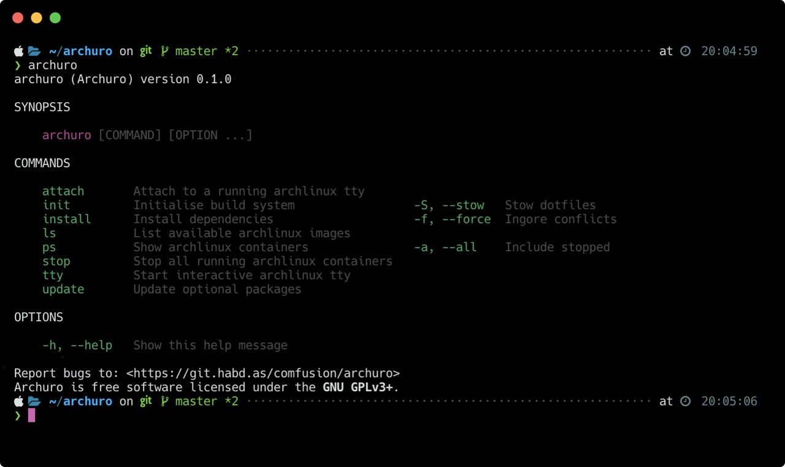

# Archuro

Portable Arch Linux development workflow for macOS Catalina.

## Features

- Installs Bash 5, patches and command completions from source
- 2 terminals: [Kitty](https://github.com/kovidgoyal/kitty) (cross-platform), [HyperTerm](https://hyper.is) (via Homebrew)
- Provides `archuro` CLI to manage Arch Linux containers on macOS Catalina
- Hotkey access to `archuro tty` command via `Ctrl+p` using Bash 5
- Adds a custom Terminal profile named Archuro for Mac
- SCM-friendly dotfile management using GNU Stow (optional)
- Opionated Brew manifest with customizable dependencies
- Vivialdi web browser for productivity and development
- Powerlevel10k for Zsh shells on macOS and Linux

## Screenshot



## Demo

Videos available. Run `ls | grep mp4` in the [`screenshots`](./screenshots) directory.

## Installation

1. Copy repository source code.
2. `make install` to install `archuro` binary to `/usr/local/bin`.
3. `archuro init` to initialize build system. Add `-S` to proceed with GNU Stow.
4. `archuro install` to install dependencies.
5. In a terminal run `bash` then `Ctrl+p` for hotkey access to `archuro tty`.

To uninstall run `make uninstall` from project root directory.

## Usage

Once you've stowed you can use `brew bundle` just like you normally would. The thing to keep in mind is that some dependencies are built from source and therefore are not designed to be managed by Homebrew. Homebrew will error on these things. And that may be OK if the intention is not to replace exiting binaries as they may be shared between mountpoints across systems.

### Sharing dotfiles

Share dotfiles between systems. To do so use docker to create a [shared file system](https://docs.docker.com/engine/reference/run/#volume-shared-filesystems) after building the `Dockerfile`. Specific steps described in more detail here:

1. Start with `docker build .` to build the Archuro `Dockerfile` image.
2. Tag image with `docker tag $(docker images -q | head -1) archlinux/extended:lastest`.
3. Confirm image available with `archuro ls` which looks for `archlinux` tagged images.

Then create a bind mount while starting an interactive tty with `zsh` as the shell:

```sh
docker run -it -v ~/archuro/stow:/root/archuro/stow archlinux/extended bash
```

At a `bash` prompt run `archuro init --stow` to install and symlink dotfiles. Then run `zsh` to access the Z shell and begin the configuration wizard of Powerlevel10k. If you don't see the configuration wizard it's likely because `~/.p10k.zsh` exists and was already sourced.

## Exposting ports

Declaring a `PORT` in a `Dockerfile` isn't enough. When running the `Dockerfile` pass the `-p` flag like `-p 8181:8080/tcp` to bind host port `8181` to `8080` of the guest.

## Package management

Installed on demand. Modify `/stow/dot-Brewfile` after running `archuro init` to adjust. Then run `archuro install` to install and `archuro update` to check for new versions and update automatically.

## Troubleshooting

Must a mess of stuff I dumped in here during initial development.

> RUNNING OUT OF HDD SPACE

❯ docker image prune
WARNING! This will remove all dangling images.
Are you sure you want to continue? [y/N] y
Deleted Images:
deleted: sha256:6c8e85e79ab8dafdfa3664574ea3a201d7e8ed8b91d039f77e32fb58ba5bc469
deleted: sha256:13b7fc8a1bc12abf3913f1d4ad1927cf534f161a4b6708c9b3d9912e95788150

Total reclaimed space: 0B

see also high tea readme

> GIT BASH COMPLETIONS AREN'T WORKING. WHAT GIVES?

You fail at life. Just kidding. You're probably on a Mac, bro.

> CUSTOM PACKAGE X ISN'T WORKING AS EXPECTED

When `brew` first installs a package and that package requires some configuration Brew will output setup instructions in a section called _Caveats_. To see the caveats again simply run `brew info <package>`.

> SOMETIMES THERE CAN BE CONFLICTS from cross-platform and Homebrew...

Error: Could not symlink bin/ffmpeg
Target /usr/local/bin/ffmpeg
already exists. You may want to remove it:
  rm '/usr/local/bin/ffmpeg'

To force the link and overwrite all conflicting files:
  brew link --overwrite ffmpeg

To list all files that would be deleted:
  brew link --overwrite --dry-run ffmpeg
Linking /usr/local/Cellar/ffmpeg/4.2.1_1... 
Using ffmpeg

> SOMETIMES THERE'S AN APP FOR THAT ALREADY WHICH WAS MANUALLY INSTALLED

==> Satisfying dependencies
==> Downloading https://spectacle.s3.amazonaws.com/downloads/Spectacle+1.2.zip
Already downloaded: /Users/jos/Library/Caches/Homebrew/downloads/b121fce845422e8d6002e6968285593312527586ff85399b56362b64b1c4e107--Spectacle 1.2.zip
==> Verifying SHA-256 checksum for Cask 'spectacle'.
==> Installing Cask spectacle
Error: It seems there is already an App at '/Applications/Spectacle.app'.
==> Purging files for version 1.2 of Cask spectacle
Installing spectacle has failed!
Homebrew Bundle failed! 1 Brewfile dependency failed to install.


> SOMETIMES MAS ITEMS IN BREWFILE GIVES YA SOME ISSUES. MAYBE LOGIN FIRST?

Using neovim
Installing openssl
Using pngquant
Using python
Installing sip
Using socat
Installing tcpdump
Using tree
Using yamllint
Using yarn
Using wget
Installing vivaldi
Using com.apple.dt.xcode
No downloads
Warning: No downloads began
Installing bitwarden has failed!
Using wireguard
Installing youtube-dl
==> Satisfying dependencies
==> Downloading https://spectacle.s3.amazonaws.com/downloads/Spectacle+1.2.zip
==> Verifying SHA-256 checksum for Cask 'spectacle'.
==> Installing Cask spectacle
Error: It seems there is already an App at '/Applications/Spectacle.app'.
==> Purging files for version 1.2 of Cask spectacle
Installing spectacle has failed!
No downloads
Warning: No downloads began
Installing amphetamine has failed!
