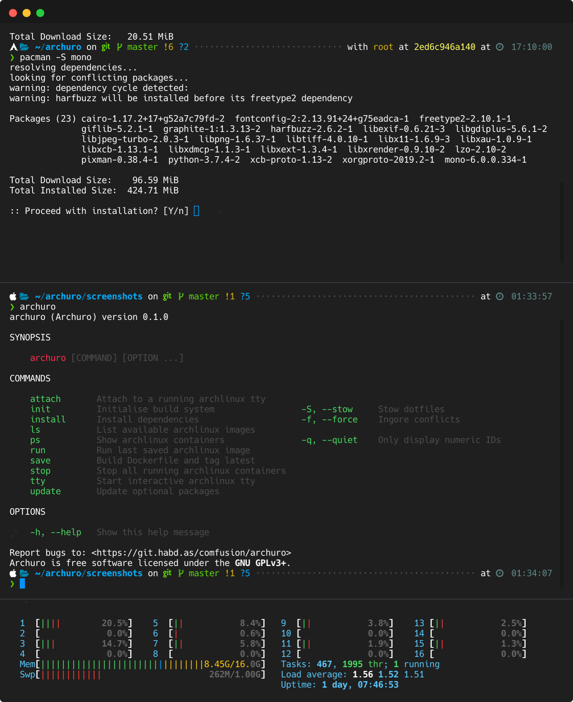
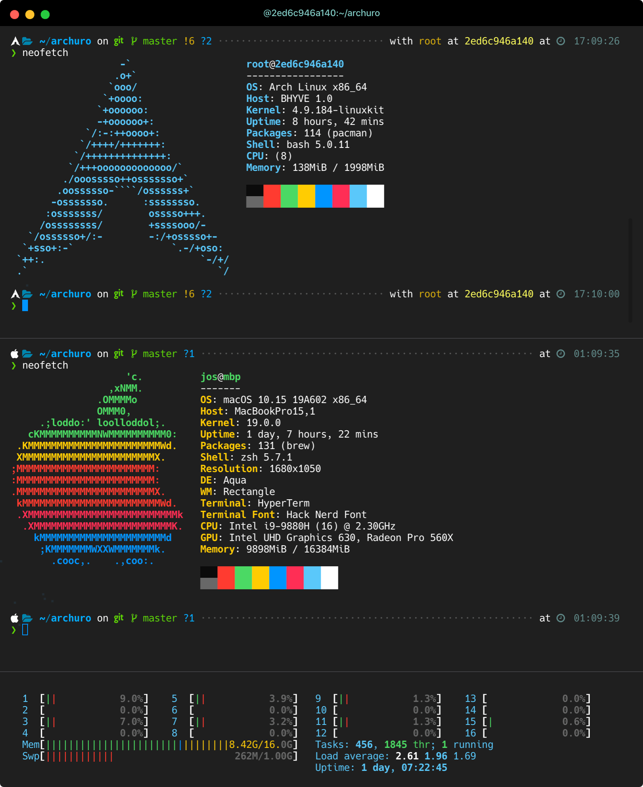

# Archuro

Build minimal, portable application development environments on macOS.


> “Simplicity is a great virtue but it requires hard work to achieve it and education to appreciate it. And to make matters worse: complexity sells better.” ― Edsger Wybe Dijkstra

## Motivation

A typical application development environment requires a number of different programs, libraries and tools to produce working software. As applications mature so too do the techniques used to build them, the languages they're written in and the platforms they run on. Furthermore, it's seldom the case a developer works on only one application at a time.

Constant churn in application development environments make it difficult to keep software running reliably over time, even on a single machine. And that's assuming your application doesn't carry around a lot of dependencies. If you wouldn't allow the kind of variance described in your production environment, why let it start during development? Thankfully you don't have to. That's why I created Archuro.

# About

Archuro is a simple CLI tool for macOS to get a hypervized Linux dev environment up and running as quickly as possible. It was created primarily to get Arch Linux running on Catalina on a 2019 MacBookPro as bare metal Arch Linux support still isn't quite there yet (though it is in progress and I recommend you use real Arch Linux if you can though, sadly, macOS will still be required to perform firmware updates on the machine which may include security patches).

## Goals

- Eliminate hidden app dependencies.
- Increase development agility.
- Improve deployment predictability.

## Affordances

- Automate macOS dev environment setup using `archuro` CLI.
- Quickly spin up throwaway [Arch Linux] containers with root access.
- Iterate on [Extended Builds](#extended-builds) of Arch Linux suited for individual workflows.
- Build ad hoc, portable environments with [LinuxKit].
- Share user configuration cross-platform using [GNU Stow].
- Adds cross-shell profile aliases [without getting clever](https://github.com/zsh-users/antigen).
- Modernizes macOS Catalina with [Bash] 5, patches and command completions.
- Manage macOS dev dependencies via [Homebrew Bundle].
- Configures [Powerlevel10k] and [Hack Nerd Font] with Zsh.
- Creates a custom profile named Archuro for Mac's Terminal app.
- Provides hotkey access to a Arch tty command via `Ctrl+p` from Bash.
- Helps install Vivaldi, a modern and developer-friendly browser.
- Automate [VS Code] setup and [helps keep track](#vs-code) of extensions.
- Recommended terminal apps: [Kitty](https://github.com/kovidgoyal/kitty) and [Hyper](https://hyper.is) with [Hyper Flat](https://github.com/Kikobeats/hyper-flat) theme.
  
## Screens and demo

<p>
  
  
</p>

Videos? Several in the [`screenshots`](./screenshots) directory.

## Requirements

- macOS though platform agnostic use is under consideration.
- Understanding of symlinks, dotfiles and how to run `stow --help`.
- Basic command line skills and patience reading instructions.

## Installation

Assumes basic knowledge of command line, git and file system management. **During development of Archuro you will also be expected to understand Shell Script and trace through `bin/archuro` to understand how it works.**

1. Copy repository source code.
2. Run `make install` to move `bin/archuro` to `/usr/local/bin`.

To uninstall run `make uninstall` from the project root directory to remove the binary installed. Then use the `stow` and `brew` commands to unlink remaining dotfiles and uninstall optional packages. See `stow -h` and `brew bundle -h` for help.


## Configuration

1. Review the dotfiles in the `stow` directory and update as desired.
2. Run `archuro init` to install build essentials.
3. Rerun `archuro init` with option `-S` use [GNU Stow] to symlink dotfiles from `stow` directory to the current user `$HOME`. Command will error if dotfile already exists to prevent overwriting existing config.
4. Comment out or remove [optional dependencies](#package-management) you're not using from `dot-Brewfile`.
5. Finally, run `archuro install` to install [optional dependencies](#package-management).

Repeat steps 2-3 on an [Extended Build](#extended-builds) of Arch Linux to share your dotfiles.

## Usage

To create a throwaway Arch Linux container run `archuro tty` or run `bash` and press `Ctrl+p`. To create a reusable Arch Linux container run `archuro build && archuro run`. See [Extended Builds](#extended-builds) for help.

Most actions in Archuro expect you're using [GNU Stow] to safely symlink your dotfiles from the `stow` directory. If you have an existing "dotfiles" repository and wish to share your shell configuration files inside Arch Linux run `archuro init` with the `-S` flag to your `$HOME` run `archuro init -S` from the project root directory after downloading a copy of Archuro.

Run `archuro --help` after [installation](#installation) for command-line usage instructions.

## SSH protocol support

Work in progress...

Create an [extended build](#extended-builds) using `archuro save --ssh` to enable SSH protocol support. Setting this option enables SSK key sharing from host using SSH Agent via `SSH_AUTH_SOCK`. For background on why this functionality exists in Docker see [Build secrets and SSH forwarding in Docker 18.09](https://medium.com/@tonistiigi/build-secrets-and-ssh-forwarding-in-docker-18-09-ae8161d066).

## Homebrew

Archuro assumes macOS development dependencies are managed using a [Brewfile](https://thoughtbot.com/blog/brewfile-a-gemfile-but-for-homebrew). The `Brewfile` keeps track dependencies and may also influence Homebrew how to tweak app installations specific for an environment. The manifest lives in `stow/dot-Homebrew` file which becomes symlinked to `~/.Brewfile` for use by the current user during `archuro init` using the `-S` flag.

## VS Code

Settings and extensions for Visual Studio Code are kept in the `stow/.vscode` directory:

```
└── stow
    ├── dot-profile
    ├── dot-vscode
    │   ├── extensions
    │   └── settings.json
```

The `stow/dot-profile` file contains scripts to manage them:

- `cx` lists currently installed VS Code extensions
- `cxinstall` attempts to install saved extensions from `~/.vscode/extensions`
- `cxsave` appends currently installed VS Code extensions to `~/.vscode/extensions`
- `cxremoveall` removes all currently installed extensions (use with care)

Platform-specific [setting locations](https://vscode.readthedocs.io/en/latest/getstarted/settings/#settings-file-locations) vary. Mac and Windows store VS Code settings along with application data and not in the user's home directory. Keep this in mind and create a symbolic link (`ln -s`) to the user `$HOME` or adjust scripts as needed. For more info on using extensions see [User and Workspace settings](https://vscode.readthedocs.io/en/latest/getstarted/settings/) on the VS Code docs site.

## Extended builds

Spinning up a disposable Arch Linux tty is great. But throwing away work doing repetitive tasks isn't. For this reason Archuro provides extended builds for persisting state and heavily caching development dependencies under Arch Linux using Docker. Think of it as your own custom build of the OS and update the `Dockerfile` provided to customize as desired. 

Run `archuro build` to automatically create and tag an `archlinux/extended` build as shown here:

```
REPOSITORY           TAG                 IMAGE ID            CREATED             SIZE
archlinux/extended   latest              0104776b36cc        2 seconds ago       616MB
archlinux/base       latest              5323a8f7a7a4        3 weeks ago         461MB
```

Rerun `archuro build` to rebuild the `Dockerfile` and update the `IMAGE ID` associated with the extended build.

## Package management

If you're backing up an existing system:

1. Run `brew bundle dump` to write all installed casks/formulae/taps into a Brewfile for you.
2. Copy that into Archuro's `stow/dot-Brewfile`.
3. Run `archuro init` to install [GNU Stow] and Bash 5 on macOS.
4. Create symlinks to your `$HOME` directory using GNU Stow with `archuro init --stow`.

Otherwise:

Modify `stow/dot-Brewfile` to adjust macOS dependencies. If you're not using Homebrew yet `archuro init` will install it alongside [GNU Stow] automatically. Then run `archuro install` or `archuro update` to check for new dependencies and install them automatically.
